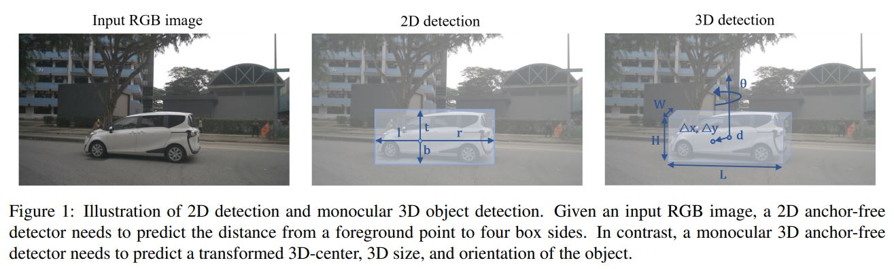
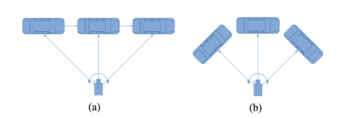
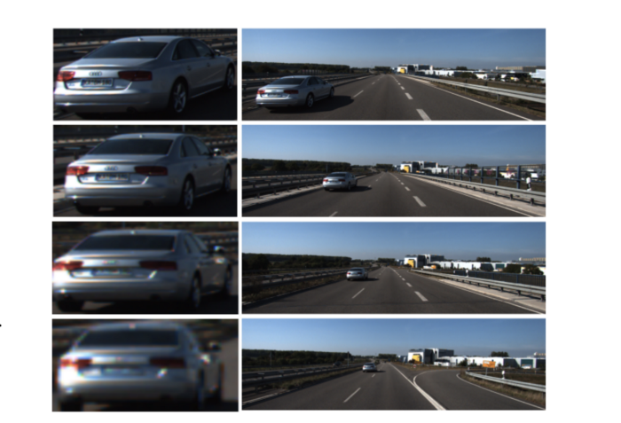

논문 정보: Wang, T., Zhu, X., Pang, J., & Lin, D. (2021). Fcos3d: Fully convolutional one-stage monocular 3d object detection. In Proceedings of the IEEE/CVF International Conference on Computer Vision
 (pp. 913-922).

---

## Abstract

본 논문에서는, fully convolutional single-stage detector 구조를 활용하는 기존 방식으로 이 문제를 연구하고, general framework FCOS 3D를 제안하였습니다.  
전체적인 pipeline은,  
(1) 먼저 7-DoF 3D target들을 image domain으로 transform 한 후,  
(2) transform한 target들을 2D와 3D attribute으로 decouple  
(3) object들을 2D scale에 따라 서로 다른 feature level로 만든 후,  
(4) projected 3D-center에 대해서만 위 결과를 assign  

center-ness는 3D target formulation 에 맞추기 위해 3D-center 기반 2D Gaussian distribution으로 다시 정의합니다. 이러한 framework은 단순하지만, 효율적으로 이전처럼 2D detector나 2D-3D correspondence 단계를 없앴습니다. 또한, NeurIPS 2020 challenge에서 1위를 달성했습니다. 

---

## Introduction

monocular 3D object detection의 가장 쉬운 solution은 2D domain의 방식을 그대로 따르고, 보조 3D attibute들을 예측하기 위한 extra component를 추가하는 것입니다.

이전 논문들 중 [30, 20]은 2D box 예측을 유지하고, 거기에 2D center들과 regions of interest에 대해 3D attribute들을 regress 하는 방식이다. [1, 9, 2]는 각 2D  anchor들에 해당하는 3D priors를 사용하여 2D와 3D box들을 동시에 예측한다.

📍 위 method와 관련된 논문  
[30] Andrea Simonelli, Samuel Rota Rota Bulo, Lorenzo Porzi, Manuel Lopez-Antequera, and Peter Kontschieder. Disentangling monocular 3d object detection. In IEEE International Conference on Computer Vision, 2019. 
[20] Fabian Manhardt, Wadim Kehl, and Adrien Gaidon. Roi10d: Monocular lifting of 2d detection to 6d pose and metric shape. In IEEE Conference on Computer Vision and Pattern Recognition, 2019.  
[1] Garrick Brazil and Xiaoming Liu. M3d-rpn: Monocular 3d region proposal network for object detection. In IEEE International Conference on Computer Vision, 2019.  
[9] Mingyu Ding, Yuqi Huo, Hongwei Yi, Zhe Wang, Jianping Shi, Zhiwu Lu, and Ping Luo. Learning depth-guided convolutions for monocular 3d object detection. In IEEE Conference on Computer Vision and Pattern Recognition, 2020.  
[2] Garrick Brazil, Gerard Pons-Moll, Xiaoming Liu, and Bernt Schiele. Kinematic 3d object detection in monocular video.In Proceedings of the European Conference on Computer Vision, 2020.  

3D Object Detection에서 해결해야 할 문제는 2D-3D correspondence로 3D target을 2D domain에 할당하고 나중에 예측을 하는 방식을 어떻게 할 것인가 입니다.FCOS3D에서 제안한 2D detector로 3D localization을 예측한 방법은 아래와 같습니다.

  1. 2D image 상에 7-DoF 3D locations를 project한 후, project된 center point를 3D-center라고 정의함. 이 projection을 통해, 3D-center는 2.5D의 정보(2D location과 그에 해당하는 depth)를 갖게 됨.

  2. 2D location은 image의 특정 지점에서 2D offset으로 더 줄일 수 있으며, 이는 2D detection에서와 같이 서로 다른 feature level 사이에서 normalize 시킬 수 있는 유일한 2D attribute 역할을 함. 그와 달리, depth, 3D size, orientation은 decoupling 이후의 3D attribute이 됨. 이 방법으로, 3D target들을 center-based paradigm으로 변환하여, 이전 방식인 2D detection이나 2D-3D correspondence를 적용하지 않아도 됨.

구현은 이름처럼 FCOS를 기반으로 하였습니다.
FCOS에 대해 간단히 설명하자면, FCOS는 simple anchor-free fully convolutional single-stage detector 입니다.
가장 먼저, object들을 2D scale을 고려하여 서로 다른 feature level(P3 ~ P7)로 생성합니다.
그런 다음, 각 training sample의 regression target들을 일치하는 projected 3D center에만 assign합니다.
FCOS와 FCOS3D의 차이점은 FCOS는 center-ness를 boundary의 distance로 나타낸 반면, FCOS 3D는 3D-center를 기반으로 한 2D 가우시안 분포로 3D center-ness를 표현합니다.

---

## Approach

다룰 내용

> 1. framework의 overview
> 2. task에 맞게 수정된 2D guided multi-level 3D prediction과 3D center-ness with 2D Gaussian distribution에 해당하는 technical design에 대한 설명

### - Framework Overview

fully convolutional one-stage detector의 세 가지 구성요소: feature extraction을 하기 위한 backbone, multi-level branches 구조를 위한 necks, dense prediction을 위한 detection heads.

- Backbone: feature extraction을 위해 pretrained ResNet101 with deformable convolutions 을 backbone으로 사용함.  memory overhead를 줄이기 위해 첫번째 convolutional block의 parameter를 고정해서 사용함.
- Neck: Feature Pyramid Network(FPN)을 사용하여  different scale에서 object를 detecting 함. original FCOS처럼 P3 ~ P5를 만든 후, P5를 downsampling 하여 P6, P7을 만듦.
- Detection Head: shared detection head를 사용할 경우, 두 가지 문제가 있음. 첫번째는, target을 다른 feature level과 point들로 distribution하는 방법임. 이 문제에 대해서는 3.2에서 다룸. 두번째 문제는, architecture를 디자인하는 방법임. 기본적인 디자인은 RetinaNet과 FCOS를 따름. 각 shared head는 4 shared convolutional block과 서로 다른 target에 대한 small head로 구성됨. measurement가 다른 regression target에 대해서 분리된 head를 두는 것이 경험적으로 더 효과적이어서 각 target마다 작은 head를 하나씩 만듦.
- Regression Targets

  FCOS에서 나온 anchor-free의 개념에 대해 간단히 설명하겠습니다.

  - $F_i \in \mathbb{R}^{H \times W \times C}$ 로 정의된 backbone의 i번째 layer에서 얻은 feature map이 주어지면, feature map의 각 point로 object를 predict해야 하며, 이는 원래 input image의 균일하게 분포된 point에 해당합니다.
  - feature map $F_i$ 상의 location $(x, y)$ 에 대해 layer $i$ 까지의 total stride가 $s$ 라 가정하면, original image에서의 location은 $(sx + \lfloor{s\over2}\rfloor, sy + \lfloor{s\over2}\rfloor)$
  - anchor-based detector가 미리 정의한 anchor로 target을 regressing 하는 것과 달리, FCOS는 이 location으로 바로 object를 예측합니다. (anchor-free)
  - 더 이상 anchor를 사용하지 않기 때문에, point가 foreground에 속하는지 여부는 GT와의 IoU(Intersection over Union)으로 판단하는 것이 아닌 <mark style='background-color: #ffd33d'>box center와 가까운 지 여부로 판단</mark>합니다.  
  
  
 
    <figcaption style="text-align:center; font-size:16px; color:#808080"> Fig1. FCOS의 2D detection vs. FCOS3D의 3D detection
    </figcaption>
    
 
   
  그림과 같이 2D의 경우, point와 top/bottom/left/right 사이의 거리를 regress 해야합니다.  
  그러나 3D의 경우, 6개의 거리(W, H, L, d, $\theta$, ($\Delta x, \Delta y$))를 regress 해야합니다. (W, H, L: 3D size, $\theta$: orientation, ($\Delta x, \Delta y$): a transformed 3D-center)  
  이를 쉽게 구현하기 위해, 7-DoF regression target을 2.5D center와 3D size로 변환합니다. 2.5D center는 camera intrinsic matrix를 사용하면 3D 공간으로 쉽게 다시 변환될 수 있기 때문에, 2.5D center를 regressing하는 것을 center에서 특정 foreground point, $\Delta x, \Delta y$, 및 그에 해당하는 Depth d로 offset을 회귀시키는 것으로 더욱 단순하게 할 수 있습니다.

  allocentric orientation을 예측하기 위해, angle $\theta$ 와 2-bin direction classification을 정의합니다.
   
  우선 allocentric orientation에 대해 간단히 설명하자면, 
  
 
    <figcaption style="text-align:center; font-size:16px; color:#808080"> Fig2. egocentric orientation vs. allocentric orientation
    </figcaption>
    
 
   
  egocentric orientation은 object의 global orientation을 생각하면 됩니다. allocentric orientation은 object가 camera 상에서 보이는 각도, 즉 local orientation이라고 생각하면 될 것 같습니다.
   
  그림에서 보면, (a)의 경우 차가 계속 오른쪽으로 진행하므로 차의 global orientation은 동일한 반면, camera 상에서 보이는 차의 angle은 달라지게 됩니다. 따라서, local orientation, 즉, allocentric orientation은 차가 이동함에 따라 바뀝니다. (b)는, 차의 global orientation이 계속 바뀌는 반면, camera 상에서 보이는 차의 orientation은 같으므로 local orientation은 동일하다고 할 수 있습니다.

  
 
    <figcaption style="text-align:center; font-size:16px; color:#808080"> Fig3. egocentric orientation vs. allocentric orientation
    </figcaption>
    
 
   

  따라서, 위 그림의 경우 object의 egocentri orientation은 동일하지만, allocentric orientation은 계속 바뀐다고 할 수 있습니다.  
  (참고: <https://towardsdatascience.com/orientation-estimation-in-monocular-3d-object-detection-f850ace91411>)
   
  다시 본론으로 돌아옵시다.
  FCOS3D에서는 allocentric orientation을 prediction하기 위해 $\theta$와 2-bin direction classification을 정의합니다.  
  $\theta$의 경우 GT bbox와 prediction bbox 간의 IoU을 만들게 됩니다.
  2-bin direction은 2개의 box가 반대 방향을 향하는 경우를 위한 정보입니다.
  

 

> Paper Link: [<https://arxiv.org/pdf/2104.10956.pdf>]
