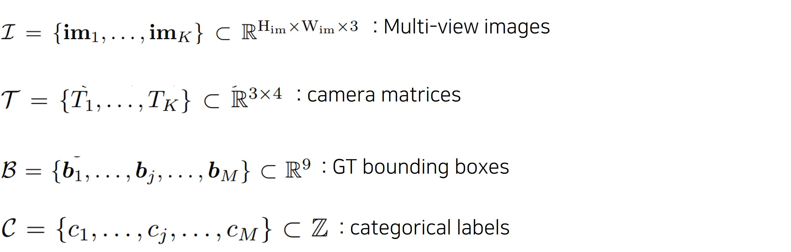
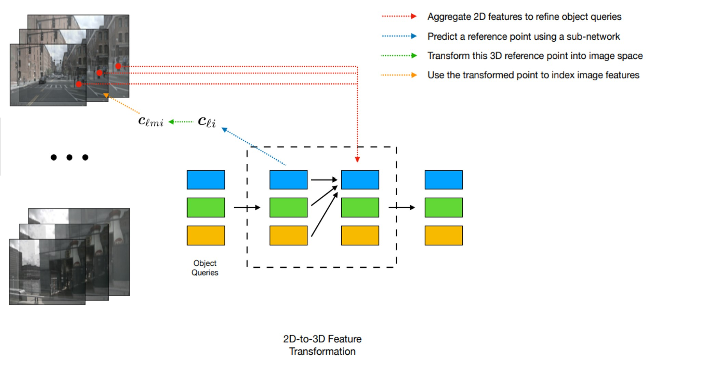

논문 정보: Wang, Y., Guizilini, V. C., Zhang, T., Wang, Y., Zhao, H., & Solomon, J. (2022, January). Detr3d: 3d object detection from multi-view images via 3d-to-2d queries. In Conference on Robot Learning (pp. 180-191). PMLR.

---

DETR3D 논문은 DETR 논문이 발표된 이후, 3D Object Detection task에 맞게 바꾼 논문입니다.   
이 논문을 잘 이해하려면 DETR 논문을 먼저 잘 알고 있어야합니다.  

----
#### Main Contribution
1. multi-camera dectection을 3D set-to-set prediction으로 처음 시도하였다. 기존 3D Object Detection의 경우, 각 camera view에서 object detection을 수행한 후, final step에서 이 결과들을 합친다. 그러나 DETR3D의 경우, 모든 layer에서 모든 camera의 view 정보를 사용하여 연산한다.  
2. backward geometric projection을 통해 2D feature extraction과 3D bounding box prediction 과정을 연결한다. 이 방법을 통해 inaccurate depth prediction으로 인한 영향을 받지 않는다.  
3. DETR과 마찬가지로, NMS 같은 post-processing이 필요 없다. 

 

----

#### Multi-view 3D Object Detection

 
  <figcaption style="text-align:center; font-size:16px; color:#808080"> Fig1. Overview of DETR3D.
  </figcaption>
  
 
 

- Input  
  - multi-view images K개 (nuScenes의 경우 6장)
  - camera matrices
  - GT bounding boxes (birds-eye view에서의 position, size, heading angle, velocity를 포함하여 9가지 attribute을 가짐)
  - categorical labels
  
 
  <figcaption style="text-align:center; font-size:16px; color:#808080"> Fig2. Inputs of feature learning.
  </figcaption>
  
 
 

- Feature Extraction  

  
 
  <figcaption style="text-align:center; font-size:16px; color:#808080"> Fig3. Feature Extraction.
  </figcaption>
  
 

  - ResNet과 FPN으로 input을 feed한 후, 4개의 feature set을 얻는다.
  -  (k= 1, 2, 3, 4) 
  - multi-scale feature를 사용함으로 서로 다른 size의 object를 더 잘 인식할 수 있음.

 
- Detection Head
  
 
  <figcaption style="text-align:center; font-size:16px; color:#808080"> Fig4. Detection Head.
  </figcaption>
  
 
   

 

> Paper Link: [<https://arxiv.org/pdf/2110.06922.pdf>]
