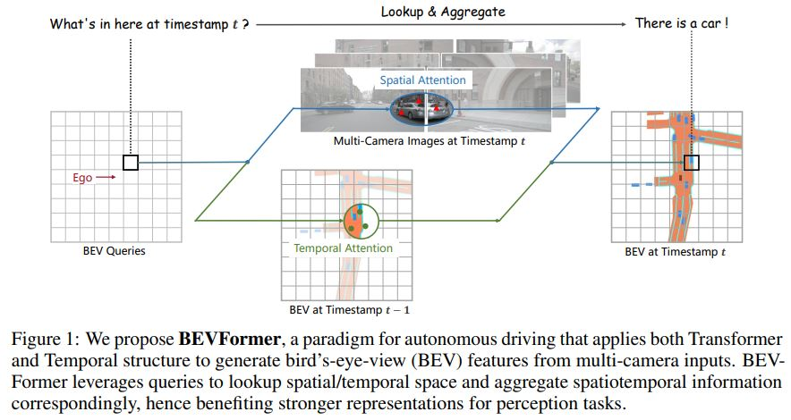
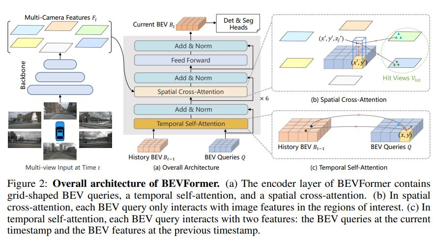
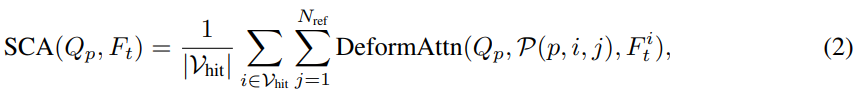
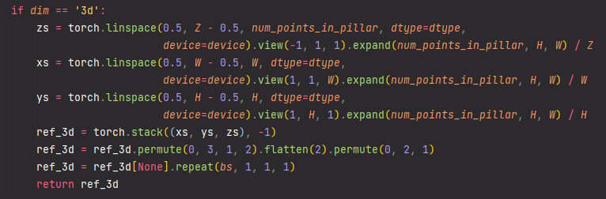

논문 정보: Li, Z., Wang, W., Li, H., Xie, E., Sima, C., Lu, T., ... & Dai, J. (2022). BEVFormer: Learning Bird's-Eye-View Representation from Multi-Camera Images via Spatiotemporal Transformers. arXiv preprint arXiv:2203.17270.  

---

이번에 리뷰할 BEVFormer 라는 논문은 2022년도 ECCV에서 발표된 논문입니다.  

 
  
 

BEVFormer의 key design은 다음과 같습니다.  
1) Grid-shaped BEV queries to fuse spatial and temporal features via attention mechanisms flexibly  
2) Spatial cross-attention module to aggregate the spatial features from multi-camera images  
3) Temporal self-attention module to extract temporal information from history BEV features, which benefits the velocity estimation of moving objects and the detection of heavily occluded objects.  

----

### BEVFormer

 
  

----

#### 3.1 Overall Architecture

BEVFormer에 사용된 6개의 encoder layer는 기존 transoformer의 encoder와는 BEV query, spatial cross-attention, temporal self-attention의 3가지 design이 추가되었다는 점이 다릅니다.

BEVFormer의 대략적인 파이프라인은,

1. T 시점에서, multi-camera image를 ResNet-101+FPN(1/16, 1/32, 1/64)로 feed, 6개의 feature를 얻음.  
2. 각 encoder에서, BEV queries로 t-1 시점의 BEV feature Bt-1으로부터 temporal self-attention으로 temporal information을 쿼리  
3. BEV queries로 multi-camera feature Ft로부터 spatial information을 Spatial Cross-Attention으로 찾음.  
4. 이 과정으로 refined BEV features를 만들고, 다음 encoder layer의 input으로 사용함. (encoder layer 수 : 6)  
5. 모든 encoder layer를 통화하면, BEV feature Bt가 만들어 지고, 3D detection과 map segmentation heat로 3D Bbox와 semantic map을 predict.  

 

#### 3.2 BEV Queries

BEVFormer에서 사용하는 query는 grid 형태이며 learnable parameters로 이루어진다.  

이 query를 BEV query라고 부르며, $ Q \in \mathbb{R} ^{H \times W \times C} $ 로 정의된다.  

이때, H, W 는 각각 BEV plane의 높이와 너비를 의미한다.  

또한, $ Q $ 상에서 $ p = (x,y) $ 에 위치한 쿼리 $ Q_{p} \in \mathbb{R} ^{1 \times C} $ 는 BEV plane 에서 위치 p에 해당하는 grid cell 영역을 의미한다.  

BEV plane 상에서 각 grid cell은 real-world size s meter 에 해당한다.  

BEV feature의 center는 ego car의 position 에 해당한다.  

해당 논문에서는 BEV query Q에 learnable positional embedding을 추가하여 BEVFormer의 input 으로 사용한다.  

 

#### 3.3 Spatial Cross-Attention

Multi camera view (6장)을 input으로 사용하기 때문에, vanilla multi-head attention을 모델로 사용하기엔 computational cost가 너무 높아서 해당 논문은 deformable attention을 기반으로 spatial cross-attention을 구현하였다.  

Deformable attention은 Query가 모든 2D feature 영역이 아닌 임의의 관심 영역과만 interaction 이 있도록 설계된 모듈이다.  

이 모듈에 대해서는 따로 포스팅하도록 하겠다.  

Deformable attention은 2D perception task에 맞게 설계 되었다 보니, 3D scenes에 적용하기 위해 약간의 수정을 했다.  

 
다시 spatial cross-attention 설명으로 넘어가자면,  

BEV place 상의 각 query들을 pillar-like query로 옮긴다.  

그 다음, 그 pillar에서 $ N_{ref} $ 개의 3D reference points를 뽑아 이 points 들을 2D view들에 project 한다.  

하나의 BEV query에서 뽑은 projected 2D points는 일부 view들에만 project가 된 형태가 된다.  

이 때, hit views를 $ V_{hit} $ 이라고 표현한다. 

그 다음, 이 2D points들을 query $ Q_{p} $ 에서 reference points 로 두고, hit views $ V_{hit} $ 에서 이 reference points 들을 중심으로 feature 를 뽑는다.  

마지막으로, 뽑은 feature 들에 대해 weighted sum을 수행한 결과가 spatial cross-attention output 이 된다.  

이 과정을 수식으로 나타내면 다음과 같다.  

 
  
  

$ i $ 는 camera view의 index, $ j $ 는 reference points의 index, $ N_{ref} $ 는 각 BEV query에서의 total reference points 를, 
$ F_{t}^{i} $ 는 i 번째 camera view의 features 를 나타낸다.   
 
각 BEV Query $ Q_{p} $ 에 대해, i 번째 view 에 대한 j 번째 reference point 를 얻기 위해  project function $ P(p, i, j) $ 를 정의한다.  
 
이 project function 이 어떻게 동작하는 지 살펴보자.  
 
우선 grid-shaped query $ Q $ 상에서 $ p=(x, y) $ 위치한 query 한 칸(?)을 $ Q_{p} $ 라고 하면, 이 $ Q_{p} $ 위치에 해당하는 real world location 을 계산한다.  

$$ x' = (x - \frac{W}{2}) * s; \quad y' = (y - \frac{H}{2}) * s \quad \quad (3) $$

이때, $H, W$ 는 BEV queries의 spatial shape 에 대한 값이고, $s$ 는 BEV's grid의 resolution size 가 된다.   
 
또한, $ (x', y') $ 은 ego car의 위치가 원점일 때의 좌표이다.  

본 논문에서 4.2 절 Experimental Settings 에 쓰여 있는 내용에 의하면, BEV Queries 의 크기는 200 * 200 이고, perception ranges 는 [- 51.2 m, 51.2 m] ,  BEV grid 의 resolution 크기 $s$ 는 0.512 m 라고 한다.  

따라서 (1) 식은 ego car 위치를 원점이라고 두었을 때의 상대적인 좌표가 된다.   

실제 코드 상에서 역시 아래와 같이 reference points 를 정해줌을 알 수 있다.   

 
  
  
 
Reference points는 Deformable DETR 논문에 정의된 것 처럼, feature map 상에서의 query 위치 정도로 생각하면 될 것 같다.  

어쨌든, 3D space 상에서 $(x', y')$ 에 위치한 object는 높이가 각기 다를 것이고, 이 object의 높이 정보는 z축 상의 $ z' $ 로 표현한다.  

$ \lbrace z_{j}' \rbrace^{N_{ref}}_{j=1} $ predefine 해서 사용함으로써, 각기 다른 높이를 갖는 object 에 대한 정보를 찾을 수 있도록 한다.  

따라서, 각 query $ Q_{p} $ 에 대해 pillar 형식의 3D reference points $ \left( x', y', z_{j}' \right)^{N_{ref}}_{j=1} $ 를 구할 수 있다.  

이 3D reference points 들을 각 카메라의 projection matrix 에 따라 각기 다른 image views에 project를 한다.  

이 연산을 수식으로 표현하면 다음과 같다.  

$$ P(p, i, j) = (x_{ij}, y_{ij}) \quad where \; z_{ij} \cdot [x_{ij} \;  y_{ij} \; 1 ]^{T} \; = \; T_{i} \cdot [x' \; y' \; z_{j}' \; 1]^{T} .\quad \quad (4) $$  

위 수식에서 $ P(p, i, j) $ 은 i 번째 view의 2D point를 의미 한다.   
 
수식을 뜯어 보면,  j 번째 reference 3D point $ (x', y', z_{j}') $ 와 i번째 카메라의 project matrix $ T_{i} \in \mathbb{R} ^{3 \times 4} $ 를 통해 $ x_{ij}, y_{ij} $ 를 찾아서 2D view 들 중 어디에 project를 할 지 정한다고 볼 수 있다.  

#### 3.4 Temporal Self-Attention

 
