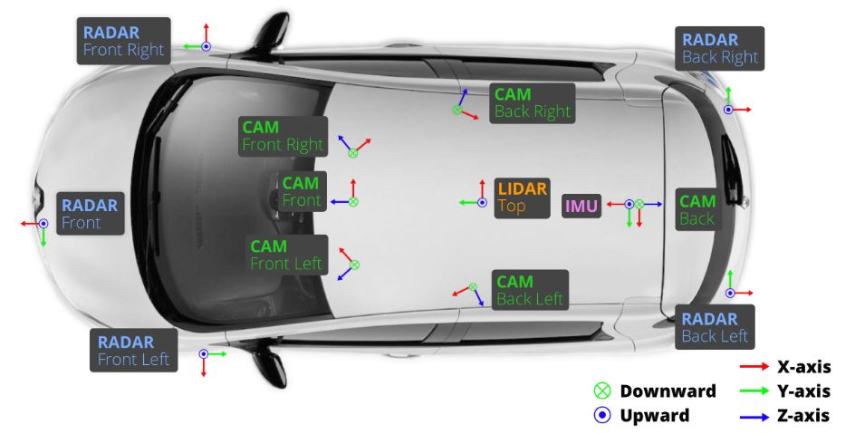

### Overview

nuScenes dataset은 자율주행 연구에서 사용하는 multi-view driving dataset 입니다. 
이 데이터는 Boston과 Singapore에서 촬영한 1000개의 driving scenes를 제공합니다.  
각 영상이 촬영된 지역은 교통량이 많은 지역이며, 한 영상당 약 20초 가량의 분량입니다.
또한, nuScenes datasets은 6개의 카메라, 1개의 Lidar, 5개의 Radar, GPS, IMU를 차량에 부착하여 데이터를 모았으며, 0.5초 마다 scene에 대한 annotation이 존재합니다.
annotation은 총 23개의 object classes에 대해 달았습니다.
따라서, 1000개의 영상에 대해 약 1.4M 개의 카메라 이미지와 390k의 LiDAR sweep, 1.4M의 Radar sweep이 존재하며, 1.4M의 object bounding box가 포함됩니다.

### Car setup

 
  
 