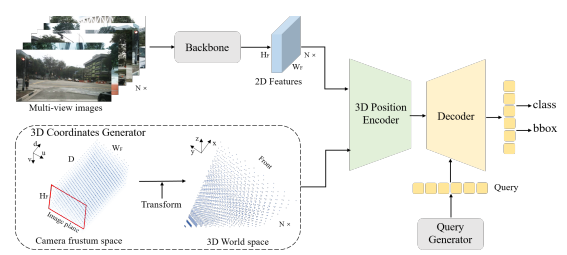

논문 정보: Liu, Y., Wang, T., Zhang, X., & Sun, J. (2022, October). Petr: Position embedding transformation for multi-view 3d object detection. In Computer Vision–ECCV 2022: 17th European Conference, Tel Aviv, Israel, October 23–27, 2022, Proceedings, Part XXVII (pp. 531-548). Cham: Springer Nature Switzerland.

---

이번에 리뷰할 PETR 라는 논문은 2022년도 ECCV에서 발표된 논문입니다.  

 
  
 
 
<u>BEVFormer의 key design은 다음과 같습니다.</u>  
1) Grid-shaped BEV queries to fuse spatial and temporal features via attention mechanisms flexibly  
2) Spatial cross-attention module to aggregate the spatial features from multi-camera images  
3) Temporal self-attention module to extract temporal information from history BEV features, which benefits the velocity estimation of moving objects and the detection of heavily occluded objects.  

----

### PETR

 
  

----
