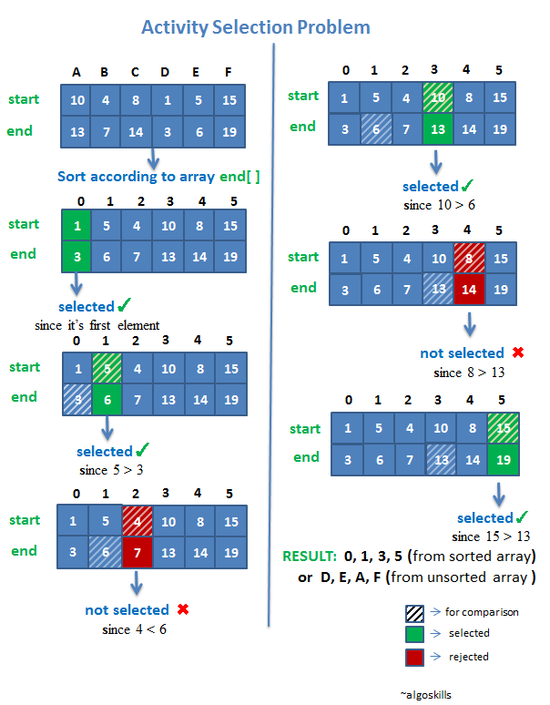

- a.k.a 탐욕 알고리즘
- 미래를 생각하지 않고 각 단계에서 가장 최선의 선택을 하는 기법을 의미함.
 
 
 
----

#### Greedy가 잘 작동하기 위한 조건들

- Greedy choice preperty : 앞의 선택이 이후의 선택에 영향을 주지 않는 조건
- Optimal Substructure: 문제의 최종적인 해결 방법이 sub problem에 대해서도 최적의 방법이었다는 조건
 
----

#### Greedy Algorithm의 장단점

- 장점: 계산 속도가 빠름
- 단점: 항상 최적해를 보장하는 것은 아님. 근사해 추정을 위해서 사용하는 것임.
 

---

#### Greedy Algorithm 적용

##### :bulb: Activity Selection Problem

  - 문제: 주어진 상황에서 최대한 많이 할 수 있는 Activity 수와 종류를 구해보자.
  
  - 조건
      - 각 활동들은 시작시간과 종료시간이 주어져 있음.
      - 한 Activity가 종료되어야 다른 Activity를 시작할 수 있음.
 
  
  - 문제 예시
      - 한 강의실에서 여러 개의 수업을 하려고 할 때 한 번에 가장 많은 수업을 할 수 있는 경우를 고르는 문제
      - 10원, 50원, 100원이 있을 때 최소 동전으로 교환하는 문제
      - 문자열 합치기(문자열들의 길이가 주어지고, 한 줄에 모든 문자열을 합칠 때 필요한 최소비용을 출력하는 문제)
 

  - 문제 해결 접근 방법
      1. 가장 먼저 end[]를 기준으로 오름차순 정렬(끝나는 시간이 같은 경우 시작 시간을 기준으로 정렬함)
      2. 첫 번째 활동은 가장 먼저 끝나는 것을 선택하는 것이 현재 단계에서의 가장 최선의 선택 : 가장 먼저 시작하는 'D'를 선택
      3. 첫 번째 활동이 끝난 시점에서 가장 먼저 끝낼 수 있을 다음 활동을 찾음 : 'E'를 선택함. 
      4. 모든 활동을 탐색할 때 까지 3의 과정을 반복함.

   
  
  
 
  
 
 

##### :bulb: 그 외 Greedy를 적용할 수 있는 문제들

  - MST, Minimum Spanning Tree
  - 거스름돈 문제
  - 분할 가능 배낭 문제
  - Dijkstra Algorithm
  - Kruskal Algorithm

2021.07.14 - [[BOJ/Greedy] 11047번: 동전 0](https://han-lim.github.io/baekjoon/baekjoon_11047/)

2021.07.14 - [[BOJ/Greedy] 1931번: 회의실 배정](https://han-lim.github.io/baekjoon/baekjoon_1931/)

2021.07.14 - [[BOJ/Greedy] 11399번: ATM](https://han-lim.github.io/baekjoon/baekjoon_11399/)

2021.07.14 - [[BOJ/Greedy] 1541번: 잃어버린 괄호](https://han-lim.github.io/baekjoon/baekjoon_1541/)

2021.07.14 - [[BOJ/Greedy] 13305번: 주유소](https://han-lim.github.io/baekjoon/baekjoon_13305/)
