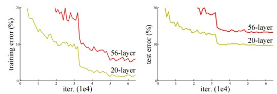
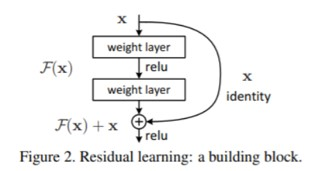
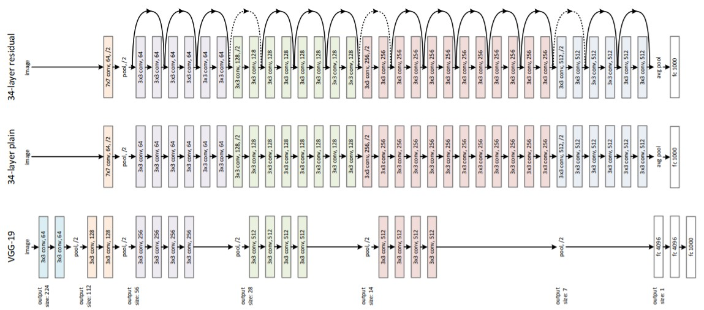
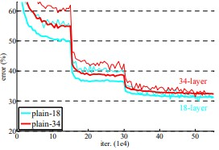
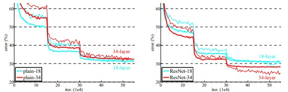
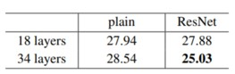
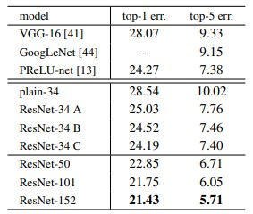
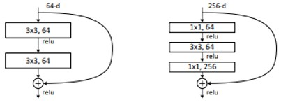
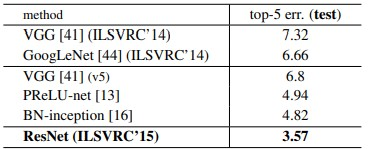

논문 정보: He, Kaiming, et al. "Deep residual learning for image recognition." Proceedings of the IEEE conference on computer vision and pattern recognition. 2016.

---

## Introduction
- VGG 모델은 모델의 depth가 깊을 수록 성능이 좋을 것이라고 가정한 구조입니다. 
- ResNet에서는 진짜 depth가 깊을 수록 좋은 네트워크인지 질문을 던집니다.
- “Is learning better networks as easy as stacking more layers?” : gradient vanishing / exploding 문제가 발생
- 이런 degradation은 overfitting 때문에 생기는 것이 아니라 deep model이라서 생기는 문제: overfitting의 문제라면 train error는 낮고, test error는 높아야 함.

 
<figcaption style="text-align:center; font-size:16px; color:#808080"> Fig1. CIFAR-10에 대한 “plain” network의 training error와 test error
</figcaption>

 
- 그렇다면, degradation 문제를 어떻게 해결해야 할까요?
  * Shallow architecture vs. Deeper architecture 실험
    * layer를 더 쌓아서 해결할 수 있는 문제인지 확인하기 위한 실험을 진행
    * 단순하게 identity mapping layer를 추가해보았습니다.
    * 그러나, deeper 모델이 더 낮은 training error를 만들지 못함을 위 그림에서 확인할 수 있습니다.  
  
- Deep residual learning framework
    - Stacked layer가 다음 layer에 바로 fit되는 것이 아니라, residual mapping에 fit하도록 하는 방식
    - 바로 mapping하는 것을 H(x)라고 할 때, F(x):=H(x)-x 라는 nonlinear layer fit을 제안하였습니다.
    - Original mapping H(x)를 다시 표현하면, F(x)+x가 됨.
Nonlinear layer들로 최적의 identity mapping을 fit하는 것 보다, residual을 0으로 만드는 것이 쉬움.
    - 위 아이디어로 발전한 모델이 ResNet 입니다.
  
- F(x) + x
    - shortcut connections: 하나 이상의 layer를 skip하는 것으로 parameter나 계산복잡도가 증가하지 않음.
    - F(x) + x: feedforward network에서 shortcut connection이 이루어짐.

 

 
<figcaption style="text-align:center; font-size:16px; color:#808080"> Fig2. shortcut connection
</figcaption>

- 이 연구의 목표
  - Plain net보다 residual net이 더 쉽게 optimize 됨을 증명
  - 이전의 network들보다 훨씬 쉽게 accuracy를 높일 수 있음을 증명
 

----
## Deep Residual Learning
- Residual Learning
    - H(x): 기본 mapping, x: input
        여러 nonlinear layer들이 복잡한 함수들을 점근적으로 근사할 수 있다는 것은, 
        residual function H(x) - x를 근사시킬 수 있음
    - F(x):=H(x) – x ➡ F(x) + x = H(x)
        : 단순히 이항한 것 뿐이지만, F(x)라는 residual function이 학습이 더 쉬움.
 
- Identity Mapping by Shortcuts
    - (1) $y = F(x, {W_i}) + x$
      - (1) 식에서 $F(x, {W_i})$ 는 학습에 사용될 residual mapping을 나타냄. 
      - Fig2. 를 이 식으로 표현하면 $F=W_2σ(W_1x)$ (σ는 ReLU를 의미하며, bias는 생략함) 
      - $F+x$을 계산하려면 shortcut connection과 element-wise addition이 수행됨.
      - (1) 식의 shortcut connection은 extra parameter와 computation complexity가 증가하지 않음을 보여줌.
    - (2) $y = F(x, {W_i}) + W_sx$
      - (2) 식에서 Ws는 shortcut connection 시 dimension을 맞춰주는 linear projection 
 
- Network Architecture
    
 
    <figcaption style="text-align:center; font-size:16px; color:#808080"> Fig3. ResNet Architecture
    </figcaption>
    

     
    - Plain Network  
        - VGG를 참고한 baseline
        - Convolution layer의 design rule
            (1) 동일한 output feature map size에 대해 layer도 동일한 filter 수를 가짐.
            (2) Feature map 크기가 절반이 되면, filter 수가 2배가 되도록 함.
        - Convolution layer 대부분이 3x3 filter 이고, stride는 2를 사용하여 downsampling 수행함.
        - Global average pooling을 마지막에 사용하며, fc layer와 softmax로 끝남.
        - 34-layer baseline의 연산량이 VGG-19의 18% 연산만 수행함.

    - Residual Network
        - Plain Net + shortcut connection
        - Identity shortcut은 input과 output 의 dimension 이 같을 때 수행됨.
        - Dimension이 증가할 경우 다음 2가지 option 을 사용
            A) 0으로 padding 을 하여 같은 차원으로 만들어 줌 ➡ parameter 가 추가되지는 않음.
            B) Linear projection 을 사용하여 dimension을 맞춰 줌.
            * “Stride 2로 이 option들을 수행할 수 있음.”
 
- Implementation
    - Residual Network
       1) Preprocessing: pixel 당 mean을 subtract
       2) Augmentation: Randomly cropping 224 * 224, horizontal flip
       3) 각 convolution과 ReLU 사이에 Batch normalization 사용
       4) He Initialize Weights
       5) SGD, mini batch size 256
       6) Learning rate 0.1 / error가 감소하지 않고 iteration이 60만 번 이하면 learning rate을 0.1배 7) weight decay 0.0001, momentum 0.9
       7) No dropout
    - Test 시에는, standard 10-crop을 수행
 

----
## Experiments

- Imagenet Classfication
    - Plain networks (Plain-18 vs. Plain-34)
        - 34-layer의 plain net이 18-layer보다 train / test error가 모두 높음. ➡ gradation problem
    - plain net 에서도 BN이 적용되므로 vanishing gradient 때문에 이런 문제가 발생하는 것은 아님.
  
 
    <figcaption style="text-align:center; font-size:16px; color:#808080"> Fig4. plain network의 depth 별 성능 차이
    </figcaption>
    

     

    - Residual networks (ResNet-18 vs. ResNet-34)
        - shortcuts을 위해 identity mapping을 사용했고, zero-padding을 사용하였음. (= A option)
        - 아래 그림과 표를 보자.
           1. 성능: ResNet-18 < ResNet-34
                  ➡ layer의 깊이가 증가했지만 degradation problem이 생기지 않았고, accuracy 도 더 높아짐. 
           2. 34 layer에서 ResNet과 plain을 비교했을 때에도 확실하게 training error 를 줄어듦.
           3. 18 layer에서는 accruracy가 비슷했지만 18-layer ResNet이 더 빨리 coverge 하였음.

    
 
    <figcaption style="text-align:center; font-size:16px; color:#808080"> Fig5. plain network, ResNet의 depth 별 성능 차이
    </figcaption>
    

     
    
 
    <figcaption style="text-align:center; font-size:16px; color:#808080"> Table1. plain network의 depth 별 성능 차이
    </figcaption>
    

     

- Identity vs. Projection Shortcuts  
아래 Table2는 다음 option들을 비교한 것임.  
    A. zero-padding으로 dimension을 증가 (parameter free)  
    B. projection shortcuts으로 dimension을 증가 (나머지 shortcuts은 identity)  
    C. 모든 shortcut들이 projection인 경우  
    - 성능: C > B > A  
    (1) A>B: zero-padding이므로 실제로는 residual learning을 하지 않음. 따라서, B가 성능이 약간 더 좋음.  
    (2) C>B: C에서 projection shortcut이 더 많았으므로 parameter 수가 증가하여 성능도 좋아짐.  
  - A/B/C의 성능 차이가 작다는 것은 projection shortcut으로 degradation problem을 해결하는데 필수적인 요소는 아니라는 의미임. ➡ 이후에 C option은 사용하지 않음.  

 
    <figcaption style="text-align:center; font-size:16px; color:#808080"> Table2. Shortcut 방식에 따른 성능 차이
    </figcaption>
    

 

- Deeper Bottleneck Architectures  
    - Training time을 고려하여 block 쌓는 방식을 Bottleneck design처럼 수정함. 
  
    - 각 Residual function F에서 layer를 3개로 쌓음.
        - conv(1 x 1) ➡ conv(3 x 3) ➡ conv(1 x 1)
        1x1 convolution이 dimension 을 reducing, restoring하여 3x3에서 input/output dimension이 더 작은 bottleneck이 되도록 함.
    - Identity shortcut이 bottleneck architecture에서 중요한 역할을 함. 
      - 아래 그림 6처럼 identity 를 projection 으로 바꾸면, shortcut이 two high-dimensional end로 연결되므로 time complexity와 model size가 두배가 됨.
    
 
    <figcaption style="text-align:center; font-size:16px; color:#808080"> Fig6. Bottleneck design
    </figcaption>
    

     

    - 50-layer ResNet
        - 기존 34-layer ResNet에서 2-layer block을 3-layer bottleneck block을 바꾼 network
        - dimension increase를 위해 option B 사용하였고, FLOPs는 3.8billion
    - 101-layer & 152-layer ResNets
        - 3-layer를 더 추가한 network
        - 152-layer ResNet이 VGG16, 19보다 depth가 훨씬 증가했지만, 
        complexit와 연산량(11.3 billion / 15.3, 19.9 billion)이 여전히 낮음.
        - 50/101/151 layer가 34-layer보다 훨씬 더 좋은 성능을 보임. 
        (degradation problem X, 깊이의 이점 활용)
    
 
    <figcaption style="text-align:center; font-size:16px; color:#808080"> Table2. 깊이에 따른 성능 차이
    </figcaption>
    

     

- Comparisons with State-of-the-art Methods
    - Single model ResNet-152로 이전 앙상블 모델들보다 더 좋은 성능을 가짐. 
    - ResNet의 6개 모델을 앙상블을 해서 top-5 error가 3.57%이 나와 ILSVRC 2015에서 우승함.

    
 
    <figcaption style="text-align:center; font-size:16px; color:#808080"> Fig7. Ensemble 모델 성능
    </figcaption>
    

     

----
VGG 모델까지는 네트워크의 층이 깊어질 수록 더 좋은 성능을 낸다고 생각했지만, ResNet은 층이 깊어지면 오히려 feature 전달이 잘 되지 않는다고 생각했습니다.   
따라서, skip-connection 기법을 추가하여 원래 feature를 계속 더해줌으로써 degradation 문제를 해결할 것을 제안합니다.  
skip-connection 기법은 최근 연구에서도 계속 언급되는 것을 보면, 정말 혁신적인 아이디어라고 생각이 드네요.