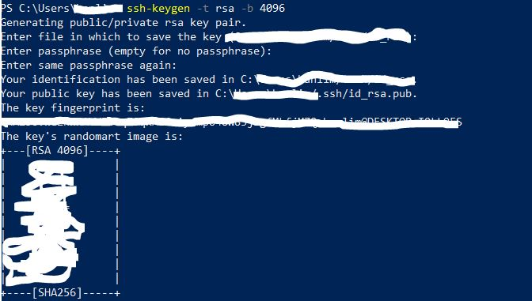
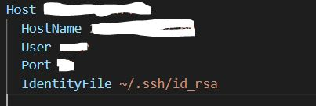

 
VSCode에서 원격으로 서버에 접속 시 매번 비밀번호를 입력하는 귀찮은 과정을 거쳐야 합니다.  
이 과정을 생략하기 위해 간단한 과정을 거치면 되니 다들 시도해보기 바랍니다!  

----

1. PowerShell이나 cmd 창을 켜서 아래 코드를 입력한다. 
      

    `ssh-keygen -t rsa -b 4096`  

    그럼 아래 사진처럼 Enter ~~~ 문장이 나오는 데 계속 엔터키를 입력한다.  
    사진처럼 이상한 그림이 나오면 id파일 발급에 성공한 것이다.  

    
 
    
 
     

    ---
2. 발급받은 키를 scp로 리눅스 서버에 옮겨야 한다.
     

    `scp -P [포트번호] .ssh_id/id_rsa.pub [username]@[ip주소]:.ssh/`
     

    ---

3. 리눅스 서버에서 scp로 받은 키를 authorized_keys에 등록해야 한다.  

    `cat id_rsa.pub >> .ssh/authorized_keys`
     

    ---

4. 마지막으로 로컬 vscode에서 F1을 눌러 'Configure SSH Host'를 누르고 config 파일에서 설정을 해야 한다.

    아래와 같이 config 파일에 key 파일의 경로를 지정하는 코드를 추가하면 완성이다.

    `IdentifyFile: ~/.ssh/id_rsa`

    
 
    
 
     