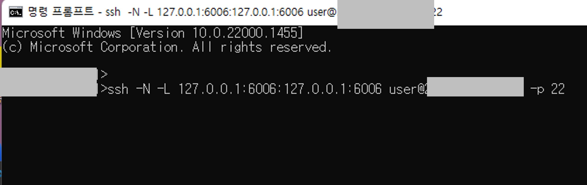
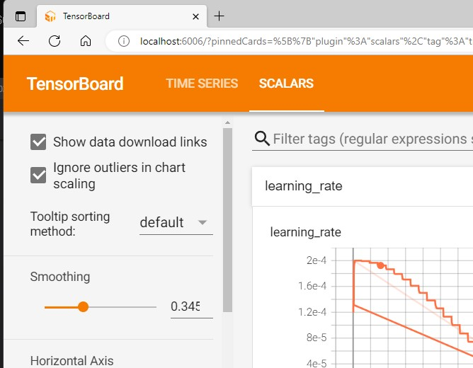

 
Tensorboard를 원격 서버에서 띄우면, localhost로 접속해야 한다. 그런데, 원격 서버에서 firefox 같은 창을 띄워서 localhost 까지 들어가는 것이 너무 번거로워서 로컬 윈도우에서 바로 접속하는 방법을 찾아보았다. 

----

1. PowerShell이나 cmd 창을 켜서 아래 코드를 입력한다. 
      

    `ssh -N -L 127.0.0.1:6006:127.0.0.1:6006 (userID)@(IP address) -p (port number)`  

    Tensorboard의 경우, localhost port 번호가 6006 이므로, 127.0.0.1:6006을 입력해주었다. 다른 port를 쓰는 경우 해당 번호를 6006 자리에 넣으면 된다. 
    
 
    
 
     

    ---
2. 로컬 환경에서 인터넷 페이지(ex. Chrome, Microsoft Egde)를 열어 127.0.0.1:6006으로 접속한다.
     

    
 
    
 
     

    ---

로컬 환경에서 원격 로컬호스트 접속 완료!!