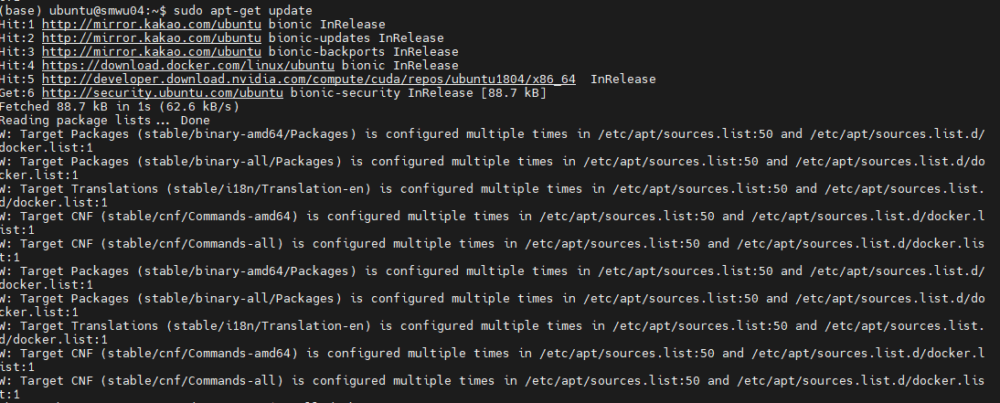
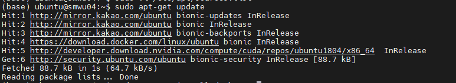

 
Docker 설치하면서, apt-get update 로 패키지들을 업데이트하려 하니 생긴 에러를 해결함.

----

apt-get update를 치니까 갑자기 "Target Packages is configured multiple times" 라는 에러가 아래 그림처럼 떴음.  

 
    
 

 
 

**1. 이 에러들은 package manager가 update 하면서 중복된 source 가 있어서 뜨는 것이어서, 일단 중복된 source 정보를 찾아야 한다.** 
      

    예시로 아래와 같이 에러 문구가 떴다면,  
    `Target Packages (main/binary-amd64/Packages) is configured multiple times in /etc/apt/sources.list:50 and /etc/apt/sources.list.d/docker.list:1`  

    이를 아래처럼 FILE_1:LINE_1 과 FILE_2:LINE_2 로 대치하자.  
    `Target Packages (main/binary-amd64/Packages) is configured multiple times in FILE_1:LINE_1 and FILE_2:LINE_2`  

    ---

**2. FILE_1 이나 FILE_2 중 한 곳에서 해당 line 내용을 삭제한다.**
   
    - FILE_1:LINE_1을 지우든가 (/etc/apt/sources.list 의 Line # 50),  
    - FILE_2:LINE_2을 지우면 됨. (/etc/apt/sources.list.d/docker.list 의 Line # 1),  

    <mark style='background-color: #ffdce0'> 주의해야 할 점은 FILE_1, FILE_2 를 둘 다 지우면 안됨. 반드시 둘 중 하나만! </mark> 
     
    <mark style='background-color: #ffdce0'> 또한, /etc/apt/sources.list 파일은 절대 지우면 안됨. security upgrades에 관련된 파일임. </mark>
     
    
    
    ---

이렇게 하면, 아래처럼 문제 해결됨!
 

 

 
 

> References  
 [1]: <https://askubuntu.com/questions/989029/w-target-packages-is-configured-multiple-times>