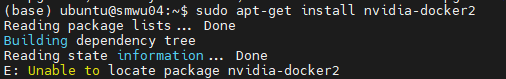
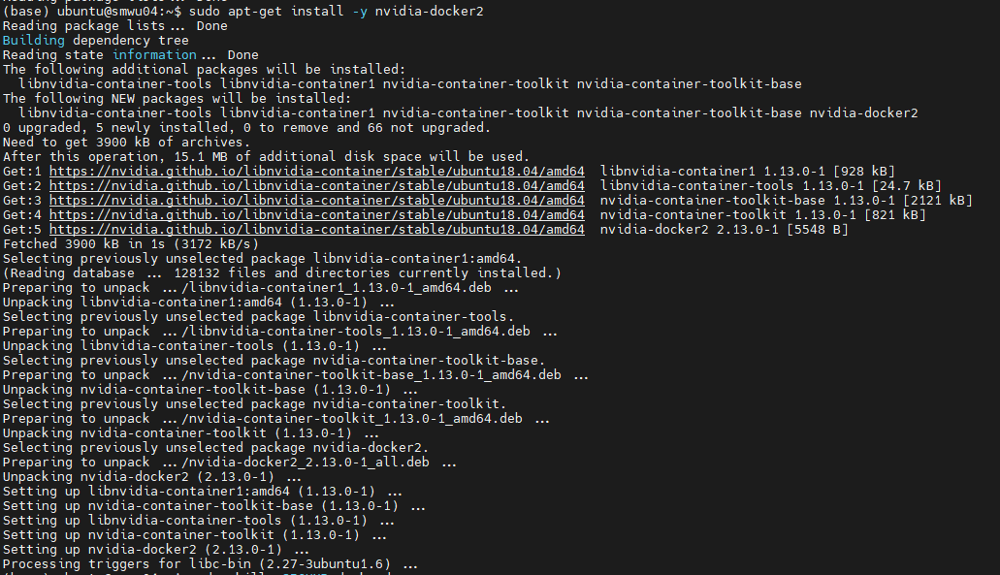

 
Docker 설치 할 때마다 만난 에러인데, 계속 까먹어서 쓰는 글임. <br>

----

sudo apt-get install nvidia-docker2 를 하려고 하니, 아래 그림과 같은 에러가 발생함. <br>  

<center> 
    </center> 

<br>
<br>

여러 글을 찾아보다가 해결된 포스팅이 있어서 옮겨 적겠음. <br>

```
sudo apt-get remove docker docker-engine docker.io

sudo apt-get install \
    apt-transport-https \
    ca-certificates \
    curl \
    software-properties-common

curl -s -L https://nvidia.github.io/nvidia-docker/gpgkey | \
  sudo apt-key add -
distribution=$(. /etc/os-release;echo $ID$VERSION_ID)

curl -s -L https://nvidia.github.io/nvidia-docker/$distribution/nvidia-docker.list | \
  sudo tee /etc/apt/sources.list.d/nvidia-docker.list
sudo apt-get update
sudo apt-get install docker-ce

# Install nvidia-docker2 and reload the Docker daemon configuration
sudo apt-get install -y nvidia-docker2
sudo pkill -SIGHUP dockerd
```
    
---

이렇게 하면, 아래처럼 설치 완료!
<br>

<center> 
</center> 
<br>

<span style="color:grey"> References <br>
 [1]: <https://github.com/NVIDIA/nvidia-docker/issues/887> <br>
 [2]: <https://github.com/NVIDIA/nvidia-docker/issues/953>
 </span>
